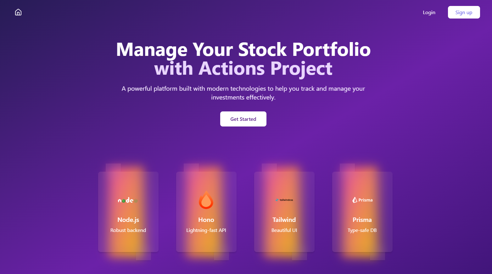
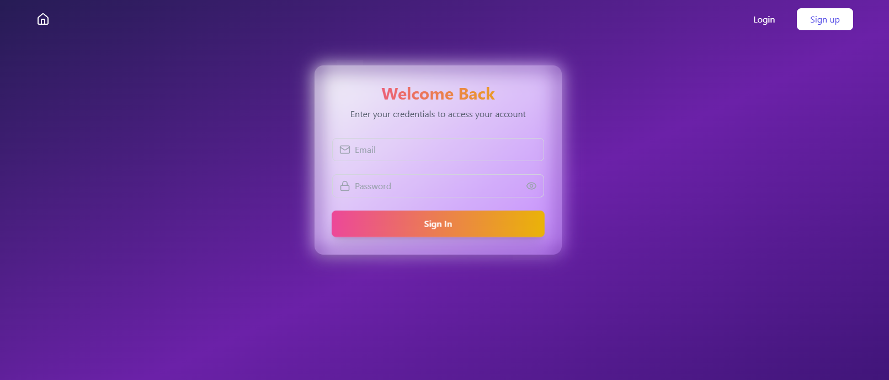
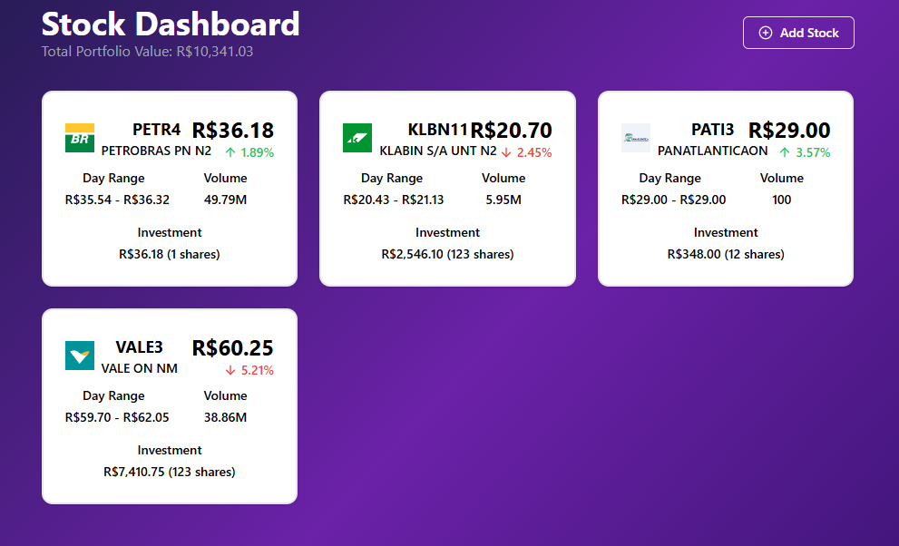
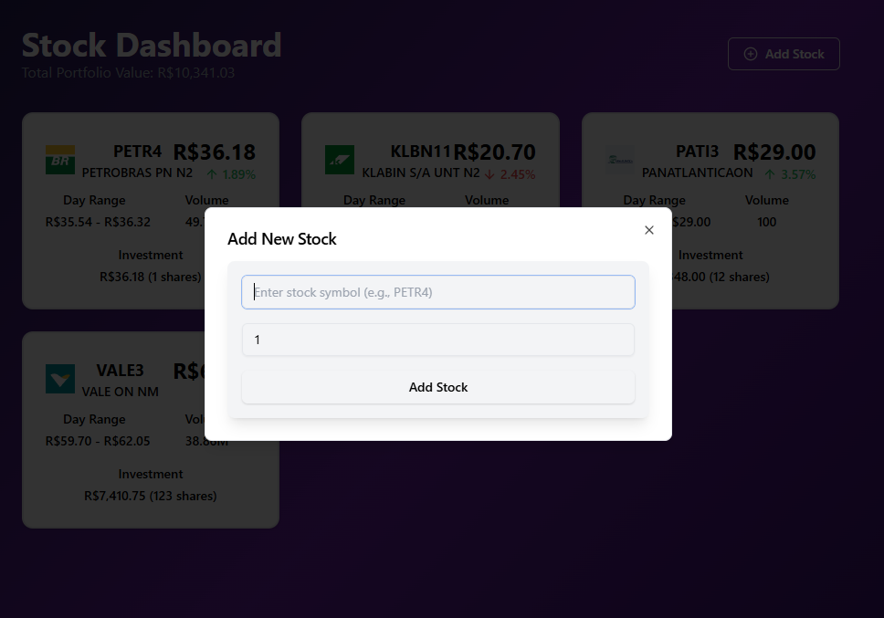
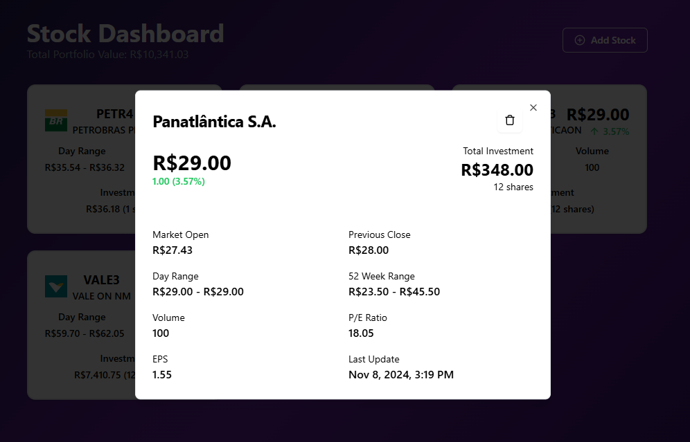

# Project Title

## Overview
Provide a brief description of the project, its purpose, and what it aims to achieve.

## Prerequisites
- Node.js (version X.X.X)
- npm (version X.X.X)

## Installation
1. Clone the repository:
   ```bash
   git clone https://github.com/Gstxxx/actions
   cd actions
   ```

2. Install dependencies:
   ```bash
   npm install
   ```
3. Generate Prisma Client:
   ```bash
   npm run generate
   npm run migrate
   npm run seed
   ```

## Running the Development Server
To start the development server, run:
```
npm run dev
```
Open your browser and navigate to `http://localhost:3000` to view the application.

## Building for Production
To build the project
```
cd client
npm install
npm run dev
```

```
open http://localhost:3000
```
#Landing Page   


#Login Page


#Stocks Page


#Create Quote Page


#Quote Details Page
